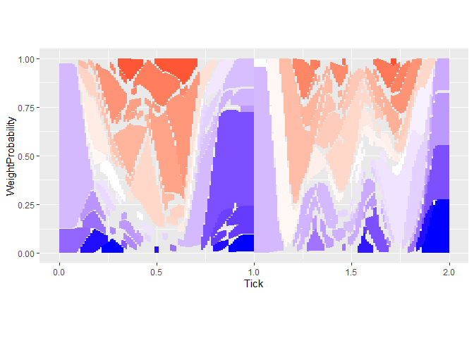
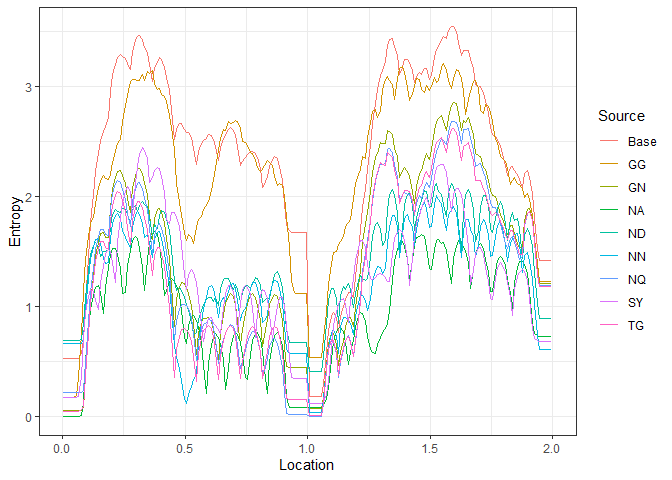

<!-- README.md is generated from README.Rmd. Please edit that file -->

# SPANTCR

### Alex Xu

### <alex.m.xu@gmail.com>

<!-- badges: start -->
<!-- badges: end -->

The goal of SPANTCR is to analyze TCR datasets.

## Installation

You can install the development version of SPANTCR from
[GitHub](https://github.com/) with:

``` r
# install.packages("devtools")
devtools::install_github("alexandermxu/SPANTCR")
```

## Example

SPAN-TCR analyzes TCR input data generated by software such as MiXCR
(<https://mixcr.readthedocs.io/en/master/index.html>).  
Sample data in the object VDJDBCMVPairedInput is obtained from
<https://vdjdb.cdr3.net/>.

A CDR3 sequence can be broken down into k-mers.  
SPAN-TCR extracts the k-mers contributing to the normalized position of
amino acids within CDR3 sequences

## Basic workflow:

1.  Prepare data.

-   Create an object AminoAcidFilter which contains relevant amino acid
    information
-   Organize TCR data with columns CDR3\|gene\|Vgene\|Jgene\|score\|id
    -   CDR3 - amino acid sequence (from MixCR)
    -   gene - TRA or TRB
    -   Vgene/Jgene - TRAV1-2, TRBJ2-2, etc.
    -   score - a score describing the quality of the TCR
    -   id - an integer used to track paired CDR3s
-   Define a scoring function
    -   The score column is often taken from an external data source
    -   Define a scoring function to scale the score appropriately
    -   This is up to your discretion
-   Define a weighting function
    -   A k-mer has its maximum binding character likely at the center
        of its position
    -   The weighting function determines how the influence of a k-mer
        increases or decreases from its center

2.  Generate CDR3Breakdown objects using SPANTCR

-   The majority of k-mers are rare and likely have minimal impact on
    binding
-   Set a significance cutoff to determine which k-mers to visualize
-   This example uses 5^x as the score function, a linear weighting as
    the weight function, and has a cutoff of 0.03
-   k-mers of length 2 are analyzed and 100 bins are used
-   k-mers are ordered by their hydrophobicity

3.  Analyze distance between CDR3s using ComparisonFunction

4.  Analyze entropy using EntropyScan

Each CDR3Breakdown object contains metadata, the ordering of elements,
and the matrix used to rank k-mers  
The clone data is broken down into the subclass
“<CDR3Breakdown@CloneData>”

``` r
library(SPANTCR)

SPANTCR_VDJDBCMVPaired <- SPANTCR(VDJDBCMVPairedInput, "VDJDBCMV", "Paired", "Hydrophobicity", 100, 2, 0.03, ScoreFunctionExponential5, WeightFunctionLinear)

head(SPANTCR_VDJDBCMVPaired@CloneData[,c(1:6,11,12,15,18)])
#>            TRACDR3      TRAVgene  TRAJgene            TRBCDR3    TRBVgene
#> 1:   CAVWMDSSYKLIF    TRAV1-2*01 TRAJ12*01    CASSQEAADNEKLFF   TRBV14*01
#> 2:    CADLQTNARLMF      TRAV5*01 TRAJ31*01      CSGGQGMVDGYTF TRBV29-1*01
#> 3: CVVNIYDFGNEKLTF   TRAV12-1*01 TRAJ48*01     CSARVMVGGTEAFF TRBV20-1*01
#> 4:    CAARANNARLMF TRAV29/DV5*01 TRAJ31*01   CASSLEYSPRPYEQYF  TRBV7-9*01
#> 5:     CATNTGNQFYF     TRAV24*01 TRAJ49*01    CASSPQTGTIYGYTF  TRBV6-5*01
#> 6:    CAVTPDGQKLLF    TRAV1-1*01           CASSPGTSGRAWNNEQFF TRBV12-3*01
#>      TRBJgene Score CompleteSlidingWindows1 CompleteSlidingWindows2
#> 1: TRBJ1-4*01     1         C,A,V,W,M,D,...   CA,AV,VW,WM,MD,DS,...
#> 2: TRBJ1-2*01     1         C,A,D,L,Q,T,...   CA,AD,DL,LQ,QT,TN,...
#> 3: TRBJ1-1*01     5         C,V,V,N,I,Y,...   CV,VV,VN,NI,IY,YD,...
#> 4: TRBJ2-7*01     5         C,A,A,R,A,N,...   CA,AA,AR,RA,AN,NN,...
#> 5: TRBJ1-2*01     5         C,A,T,N,T,G,...   CA,AT,TN,NT,TG,GN,...
#> 6: TRBJ2-1*01     5         C,A,V,T,P,D,...   CA,AV,VT,TP,PD,DG,...
#>        CompleteSlidingWindows3
#> 1: CAV,AVW,VWM,WMD,MDS,DSS,...
#> 2: CAD,ADL,DLQ,LQT,QTN,TNA,...
#> 3: CVV,VVN,VNI,NIY,IYD,YDF,...
#> 4: CAA,AAR,ARA,RAN,ANN,NNA,...
#> 5: CAT,ATN,TNT,NTG,TGN,GNQ,...
#> 6: CAV,AVT,VTP,TPD,PDG,DGQ,...
```

The TCR data is processed into the subclass “<CDR3Breakdown@Output>”  
Each row is a single clone in a single bin

``` r
head(SPANTCR_VDJDBCMVPaired@Output)
#>    Window   ChainsVgene ChainsJgene  Probability WeightProbability  Tick
#> 1:     CA    TRAV1-2*01   TRAJ12*01 0.0002852253      0.0003250244 0.005
#> 2:     CA      TRAV5*01   TRAJ31*01 0.0002852253      0.0003000225 0.005
#> 3:     CV   TRAV12-1*01   TRAJ48*01 0.0014261266      0.0018751406 0.005
#> 4:     CA TRAV29/DV5*01   TRAJ31*01 0.0014261266      0.0015001125 0.005
#> 5:     CA     TRAV24*01   TRAJ49*01 0.0014261266      0.0013751031 0.005
#> 6:     CA    TRAV1-1*01             0.0014261266      0.0015001125 0.005
#>      Entropy WeightEntropy         Max   WeightMax Origin Color
#> 1: 0.5568032     0.5202342 0.833428408 0.846913519      1    90
#> 2: 0.5568032     0.5202342 0.833428408 0.846913519      2    90
#> 3: 0.5568032     0.5202342 0.003422704 0.004475336      3   125
#> 4: 0.5568032     0.5202342 0.833428408 0.846913519      4    90
#> 5: 0.5568032     0.5202342 0.833428408 0.846913519      5    90
#> 6: 0.5568032     0.5202342 0.833428408 0.846913519      6    90
#>    SignificantOrigin SignificantWindow SignificantColor
#> 1:                 0                88               65
#> 2:                 0                88               65
#> 3:                 0                 0                0
#> 4:                 0                88               65
#> 5:                 0                88               65
#> 6:                 0                88               65
```

SPANTCR plots can be generated using ggplot2  
Ordering output by the same AAOperation will stack bar plots
appropriately  
The levels of factor (Window) will match the AAOperation order

``` r
library(ggplot2)

ggplot(SPANTCR_VDJDBCMVPaired@Output[order(Window)])+
  geom_bar(aes(x=Tick, y=WeightProbability, fill=SignificantColor), stat="identity", width=1/100)+
  theme(legend.position="none")+
  scale_fill_gradientn(colors=c(alpha("#4D4D4D",0.01),"red","white","blue"), values=c(0,0.01,0.50,1))+
  coord_fixed()
```



The distance between sets of CDR3s can be measured using
ComparisonFunction  
Here we compare Levenshtein distance between VDJDBCMV Paired CDR3s and
their nearest neighbor in the set

``` r
CMVSelfDistance <- ComparisonFunction(SPANTCR_VDJDBCMVPaired, SPANTCR_VDJDBCMVPaired, 100, FineBinTicksPaired, BLOSUMCappedDiff, F)
#> 0.005/ 0.015/ 0.025/ 0.035/ 0.045/ 0.055/ 0.065/ 0.075/ 0.085/ 0.095/ 0.105/ 0.115/ 0.125/ 0.135/ 0.145/ 0.155/ 0.165/ 0.175/ 0.185/ 0.195/ 0.205/ 0.215/ 0.225/ 0.235/ 0.245/ 0.255/ 0.265/ 0.275/ 0.285/ 0.295/ 0.305/ 0.315/ 0.325/ 0.335/ 0.345/ 0.355/ 0.365/ 0.375/ 0.385/ 0.395/ 0.405/ 0.415/ 0.425/ 0.435/ 0.445/ 0.455/ 0.465/ 0.475/ 0.485/ 0.495/ 0.505/ 0.515/ 0.525/ 0.535/ 0.545/ 0.555/ 0.565/ 0.575/ 0.585/ 0.595/ 0.605/ 0.615/ 0.625/ 0.635/ 0.645/ 0.655/ 0.665/ 0.675/ 0.685/ 0.695/ 0.705/ 0.715/ 0.725/ 0.735/ 0.745/ 0.755/ 0.765/ 0.775/ 0.785/ 0.795/ 0.805/ 0.815/ 0.825/ 0.835/ 0.845/ 0.855/ 0.865/ 0.875/ 0.885/ 0.895/ 0.905/ 0.915/ 0.925/ 0.935/ 0.945/ 0.955/ 0.965/ 0.975/ 0.985/ 0.995/ 1.005/ 1.015/ 1.025/ 1.035/ 1.045/ 1.055/ 1.065/ 1.075/ 1.085/ 1.095/ 1.105/ 1.115/ 1.125/ 1.135/ 1.145/ 1.155/ 1.165/ 1.175/ 1.185/ 1.195/ 1.205/ 1.215/ 1.225/ 1.235/ 1.245/ 1.255/ 1.265/ 1.275/ 1.285/ 1.295/ 1.305/ 1.315/ 1.325/ 1.335/ 1.345/ 1.355/ 1.365/ 1.375/ 1.385/ 1.395/ 1.405/ 1.415/ 1.425/ 1.435/ 1.445/ 1.455/ 1.465/ 1.475/ 1.485/ 1.495/ 1.505/ 1.515/ 1.525/ 1.535/ 1.545/ 1.555/ 1.565/ 1.575/ 1.585/ 1.595/ 1.605/ 1.615/ 1.625/ 1.635/ 1.645/ 1.655/ 1.665/ 1.675/ 1.685/ 1.695/ 1.705/ 1.715/ 1.725/ 1.735/ 1.745/ 1.755/ 1.765/ 1.775/ 1.785/ 1.795/ 1.805/ 1.815/ 1.825/ 1.835/ 1.845/ 1.855/ 1.865/ 1.875/ 1.885/ 1.895/ 1.905/ 1.915/ 1.925/ 1.935/ 1.945/ 1.955/ 1.965/ 1.975/ 1.985/ 1.995/

CMVSelfDistance[, SecondChain := sapply(Top5Chain, function(x) x[2])]
CMVSelfDistance[, SecondChainScore := sapply(Top5CompScore, function(x) x[2])]
CMVSelfDistance[, SecondChainLev := diag(adist(SecondChain, BaseCDR3))]

ggplot(CMVSelfDistance)+
  geom_point(aes(x=SecondChainLev, y=SecondChainScore))+
  coord_fixed()
```


Entropy analysis is performed across ranges of CDR3 using EntropyScan,
or in specific windows using SearchIterator  
EntropyScan is a wrapper for SearchIterator  
Entropy across the entire range of k-mers and positions is summarized in
the first list element of the output

``` r
SearchBoxesPaired20 <- mapply(c, seq(0,1.9,length.out=20), seq(0.1,2,length.out=20), SIMPLIFY=F)
VDJDBCMV_Entropy <- EntropyScan(SPANTCR_VDJDBCMVPaired, SearchBoxesPaired20, 0.03, FineBinTicksPaired)

VDJDBCMV_Entropy[[1]]$Source <- factor(VDJDBCMV_Entropy[[1]]$Source, levels=c("Base", sort(unique(VDJDBCMV_Entropy[[1]]$Source)[-1])))

ggplot(VDJDBCMV_Entropy[[1]][Count>20])+
  geom_tile(aes(x=Range, y=Source, fill=DeltaAverage))+
  scale_x_discrete(breaks=c("0-0.1","1-1.1","1.9-2"), labels=c(0,1,2))+
  scale_fill_gradient2(low="blue", mid="white", high="red", midpoint = 1)+
  theme_dark()
```


Individual CDR3 entropy lines for specific sets of TCRS can be plotted
using data from the second list element of the output

``` r
ggplot(VDJDBCMV_Entropy[[2]][N>10 & Range=="0.5-0.6"])+
  geom_line(aes(x=Location, y=Entropy, color=Source))+
  theme_bw()
```


